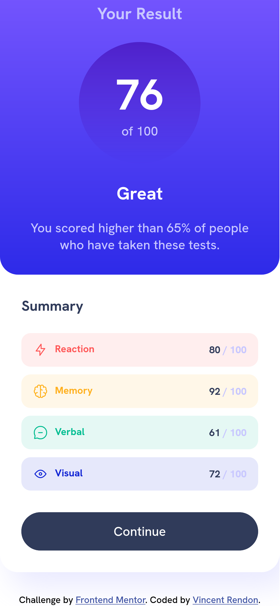

# Frontend Mentor - Results summary component solution

This is a solution to the [Results summary component challenge on Frontend Mentor](https://www.frontendmentor.io/challenges/results-summary-component-CE_K6s0maV). Frontend Mentor challenges help you improve your coding skills by building realistic projects. 

## Table of contents

- [Overview](#overview)
  - [The challenge](#the-challenge)
  - [Screenshot](#screenshot)
  - [Links](#links)
- [My process](#my-process)
  - [Built with](#built-with)
  - [What I learned](#what-i-learned)
- [Author](#author)
- [Acknowledgments](#acknowledgments)

**Note: Delete this note and update the table of contents based on what sections you keep.**

## Overview

### The challenge

Users should be able to:

- View the optimal layout for the interface depending on their device's screen size
- See hover and focus states for all interactive elements on the page

### Screenshot





### Links

- Solution URL: [Add solution URL here](https://github.com/Batestickro/resultSummaryFEMentor)
- Live Site URL: [Add live site URL here](https://batestickro.github.io/resultSummaryFEMentor/)

## My process

### Built with

- Semantic HTML5 markup
- CSS custom properties
- Flexbox
- CSS Grid
- Sass css
- BEM methodology
- Desktop-first workflow


### What I learned

This challenge Helped me practice the fundamental concepts of html and css, I really struggle in the summary card where are the details and score of the different aspects with the images and colors, and I had to think about how to name the classes of the elements to no repeat code in the css, still was hard to think semantic names for all the classes and use the Sass and BEM workflow to write a clean code without repeating myself too much, I named the section "details" and I treated like a block with elements and modifiers following the BEM methodology hoping the code will be more readeble and maintainable.

To see how you can add code snippets, see below:

```html
<div class="details__subject details__subject_reaction">
  <div class="details__stat">
    
    <span class="details__stat-reaction">Reaction</span>
  </div>
  <p><span class="details__score">80</span> / 100</p>
</div>
```
```css
.details {
  margin-top: 2.5rem;
  height: 62%;
  display: grid;
  align-content: space-between;

  @media only screen and (max-width: 37.5em) {
    height: 22rem;
  }


  &__subject {
    padding: 1.3rem 1.6rem;
    font-size: 1.4rem;
    border-radius: 1.3rem;
    display: flex;
    justify-content: space-between;
    align-items: center;


    &_reaction {
      background-color: rgba(255, 87, 87, .1);
    }
```

## Author

- Frontend Mentor - [@Batestickro](https://www.frontendmentor.io/profile/yourusername)
- Twitter - [@Batestickro](https://www.twitter.com/yourusername)
